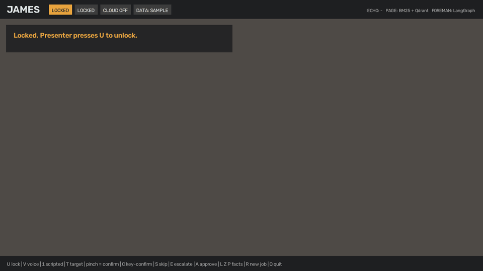

<p align="center">
  
</p>

<p align="center">
  
  
  
  
  
  
  <a href="https://jamesagent.vercel.app/"></a>
</p>

<h3 align="center">A touch-free, multi-agent maintenance copilot.<br>Point at the machine. Ask out loud. Pinch to confirm each step.</h3>

<p align="center"><a href="https://jamesagent.vercel.app/"><b>jamesagent.vercel.app</b></a> &nbsp;·&nbsp; the product site</p>

<p align="center">
  <a href="#-see-it">See it</a> ·
  <a href="#-how-it-works">How it works</a> ·
  <a href="#-the-safety-gate">Safety gate</a> ·
  <a href="#-quick-start">Quick start</a> ·
  <a href="#-the-90-second-demo">Demo</a> ·
  <a href="#-agents">Agents</a> ·
  <a href="https://jamesagent.vercel.app/">Website</a>
</p>


A technician with gloves on and both hands busy cannot scroll a PDF manual. JAMES watches the camera, listens,
finds the right procedure in the manual, checks the machine's sensor log and past repairs, and walks through the
fix one step at a time. Every step needs a physical pinch to confirm, and a rule engine with no AI in it refuses
any step that is unsafe. Everything runs on the laptop: local model, local search, local memory.

> [!NOTE]
> This is a demo build. It ships with **sample data** and **demo safety rules** (PUMP-UTIL v0.1). They are not
> approved for any real plant, and nothing here is certified for safety use.

## ◆ See it

<p align="center">
  
  <br>
  <sub>The real app screens from rehearsal mode (<code>python app.py --sim</code>): lock, target the pump, sourced steps, a safety block, the fix, and a second run that recalls the approved job.</sub>
</p>

## ◆ How it works

<p align="center">
  
</p>

<table>
<tr>
<td width="33%" valign="top">

**Hands-free by design**<br>
<sub>Point to pick a target, V sign to talk, pinch and hold to confirm. Keyboard fallbacks are labelled on screen and in the log.</sub>

</td>
<td width="33%" valign="top">

**Every answer has a source**<br>
<sub>Steps come from the manual with page citations. Readings come from the supplied log. Nothing is invented; if the evidence is weak, it says so.</sub>

</td>
<td width="33%" valign="top">

**It learns from approved jobs**<br>
<sub>When a senior approves a repair, the next similar request recalls it first. Unapproved jobs are never recalled.</sub>

</td>
</tr>
<tr>
<td valign="top">

**Honest status bar**<br>
<sub>The top bar always shows which backend is live (model or rules, BM25 or BM25 + Qdrant), so nothing is overstated.</sub>

</td>
<td valign="top">

**Industry packs, not hard-coding**<br>
<sub>Rules, faults, sensors, manuals and asset tags live in a pack. The app refuses to start if a pack file changed after its manifest.</sub>

</td>
<td valign="top">

**A voice that talks back**<br>
<sub>Optional neural voice (Kokoro-82M, on-device), with a switch in the header to mute it.</sub>

</td>
</tr>
</table>

## ◆ The safety gate

<p align="center">
  
</p>

WARDEN is plain Python plus the pack's rule file. The model can suggest a step; only WARDEN can let it through,
and only a pinch on the current, unexpired, allowed step moves the job forward.


## ◆ Quick start

```bash
git clone https://github.com/victorisaacchinta-eng/james.git
cd james
bash setup.sh
```

`setup.sh` makes a virtual environment, installs everything, downloads the speech model and runs the tests. It ends
with `422 passed` (the `tests/` folder), `PACK CHECK: PASS` and `RESULT: PASS`. The full suite,
`python -m pytest -q`, also runs `lab/tests` (449 passed on macOS, Python 3.11).

If [Ollama](https://ollama.com) is installed, setup also pulls `qwen3-vl:4b` and `nomic-embed-text`. Without Ollama,
JAMES still runs with keyword rules and BM25 search, and says so on screen.

<details>
<summary><b>Neural voice (optional)</b></summary>

<br>

`setup.sh` installs `kokoro-onnx==0.6.1` but not the voice model files (348 MB, too big for GitHub). Fetch them once:

```bash
source .venv/bin/activate
python -m tools.get_voice
```

It downloads `kokoro-v1.0.onnx` (326 MB) and `voices-v1.0.bin` (28 MB) from the
[kokoro-onnx release `model-files-v1.1`](https://github.com/thewh1teagle/kokoro-onnx/releases/tag/model-files-v1.1)
into `assets/voice/`, checks each against a pinned sha256 and refuses a mismatch. It ends with `neural voice: ready`.
Without these files JAMES speaks with the macOS `say` voice.

</details>

<details>
<summary><b>Optional settings</b></summary>

<br>

- `export JAMES_GOOGLE_ACCOUNT=you@example.com` makes the Gmail, Drive and Calendar launcher links open that account.
- `config.py`: `PINCH_RATIO` (raise it if gloves make pinching hard), `POINT_STABLE_FRAMES`, `CAMERA_INDEX`, `WHISPER_MODEL`.
- `JAMES_PACK=<pack-id>` picks a different industry pack (default `pharma-utility`).

</details>

### Run

```bash
source .venv/bin/activate
python app.py              # camera + microphone
python app.py --no-voice   # camera only; key 1 sends the request
python app.py --sim        # rehearsal: no camera or mic, saves every screen to data/sim_frames/
python james.py            # the everyday assistant: gestures, voice, app launcher
```

macOS asks for Camera and Microphone access for Terminal the first time: allow both, then run again.
Click the JAMES window once so it receives key presses.

Before a live demo: print `assets/asset_tag_P-3.pdf` at 100% and stick it on the "pump" (or show
`asset_tag_P-3.png` full screen on a phone), and start the local model with `ollama serve`.

## ◆ The 90-second demo

| Do | JAMES shows |
|---|---|
| **U** | Unlocks. "Point at the machine's asset tag." |
| Point at the tag | Ring on P-3 with confidence. (Tag visible but not pointed at: "Is this P-3?", pinch to confirm) |
| **Pinch** (hold) | PPE confirmed |
| **V**, say *"Pump 3 is vibrating more than usual"*, **V** | Transcript, then PAGE + PULSE + LEDGER in parallel, likely cause, Step 1 with sources |
| **Pinch** | Step 1 confirmed and logged, Step 2 appears |
| **S**, **S** (skip lockout on purpose) | Step 4 "Remove the coupling guard": **BLOCKED BY SAFETY POLICY, LOTO-01, ZERO-01** |
| **Pinch**, **Pinch** | Lockout, then zero energy confirmed; WARDEN re-checks; step allowed |
| **Pinch**, **Pinch** | Steps 4 and 5 confirmed; job complete; repair record saved in `records/` |
| **A**, then **R** and repeat the request | A senior approves the job; the second run recalls it first ("Similar case: job:J-1xx") |

Backup if the mic fails: key **1** sends the scripted request, labelled **[SCRIPTED INPUT]** on screen.
Backup if the pinch fails with gloves: key **C** confirms, labelled and logged as `key_fallback`.

<details>
<summary><b>Everyday assistant (<code>python james.py</code>): gestures and voice</b></summary>

<br>

| Do | What happens |
|---|---|
| Open palm (idle) | Launcher: point at an app and pinch to open it |
| **V sign** (hold ~0.4 s) | Starts listening. Keep holding while you talk |
| **Fist** | Stops listening and runs the command. Open palm cancels |
| Say "open Chrome and play Despacito" / "play believer on Spotify" | The voice window shows what was heard and each step, with a tick or a cross |
| **K** / **X** | Enrol / forget the owner ring (a visual filter that keeps background hands out, not security; **U** locks) |

Voice commands open apps and web pages, search, play music and collect links into Notes. JAMES never sends a
message to a person by itself, never handles logins and never presses send in an AI chat.

</details>

## ◆ Agents

| Agent | Job | Where | Stack |
|---|---|---|---|
| **LENS** | Sees hands and the asset tag | `agents/lens.py` | MediaPipe Hand Landmarker, OpenCV ArUco |
| **ECHO** | Hears the request | `agents/echo.py` | sounddevice, faster-whisper `base.en`, Qwen3-VL 4B via Ollama (keyword rules if offline) |
| **PAGE** | Finds the procedure | `agents/page.py` | PyMuPDF, BM25, nomic-embed-text in Qdrant (in-process); re-queries when weak; cites pages |
| **PULSE** | Reads the sensor log | `agents/pulse.py` | pandas on the supplied log; never invents a reading |
| **LEDGER** | Remembers approved jobs | `agents/recall.py`, `james_core/ledger.py` | SQLite, append-only |
| **FOREMAN** | Plans and decides the cause | `agents/foreman.py` | LangGraph fan-out to PAGE, PULSE, LEDGER; local model or source vote |
| **WARDEN** | Blocks unsafe steps | `james_core/safety_guard.py` | Plain Python + the pack's rules; no AI |
| **Pinch gate** | Confirms each step | `app.py`, `james_core/session.py` | Pinch and hold 600 ms on the current, unexpired, allowed step |

## ◆ Industry packs

Everything about the machines lives in `packs/<pack-id>/`, not in the code: WARDEN rules and their seeded cases,
the fault vocabulary, sensor channels, the manual and the asset tags. The format is in [`PACK_FORMAT.md`](PACK_FORMAT.md).

```bash
python -m james_core.pack check packs/pharma-utility    # validate + run the seeded cases
python -m james_core.pack rehash packs/pharma-utility   # after you edit a pack file (dev only)
```

Packs are not signed yet.

## ◆ Numbers, and where they come from

- `python -m james_core.suite` prints the seeded safety result: **8/8 violations blocked, 0/4 false blocks**.
- Every live run appends to `data/runs.csv` (`--sim` runs and tests do not): time from the end of speech to the
  first sourced step, and which backends were live. Timing claims should only be quoted from that file.
- Files it writes: `data/james.db` (log and jobs), `data/runs.csv`, `records/repair_record_*.md`,
  `records/escalation_*.md`. Delete `data/james.db` to reset the demo memory.

## ◆ Roadmap

- Signed packs (ed25519) and a second pack with an air-handling unit
- Simulated Modbus / MQTT sensor adapter
- Windows, Linux and edge devices (today it runs on macOS)
- Telugu and Hindi voice

## ◆ More documents

- [`USER_MANUAL.md`](USER_MANUAL.md): every gesture, key and voice command
- [`PACK_FORMAT.md`](PACK_FORMAT.md): the industry pack format
- [`docs/ITERATIONS.md`](docs/ITERATIONS.md): how the build evolved, iteration by iteration, with what ran live on a Mac and what is only tested

## ◆ Licence

MIT, see [`LICENSE`](LICENSE). Third-party parts keep their own licences. The optional neural voice (`kokoro-onnx`)
pulls in `phonemizer` / `espeak-ng`, which are GPL-3.0; pip installs them on your machine and they are not included
in this repository. The Kokoro-82M model is Apache-2.0.


<p align="center"><sub>Built by <a href="https://github.com/victorisaacchinta-eng">Chintha Victor Isaac</a>.</sub></p>
